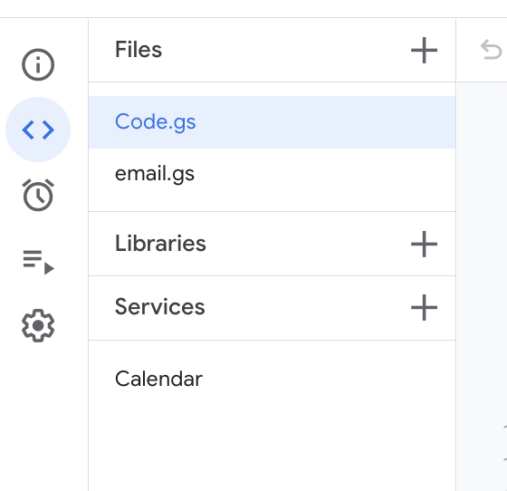
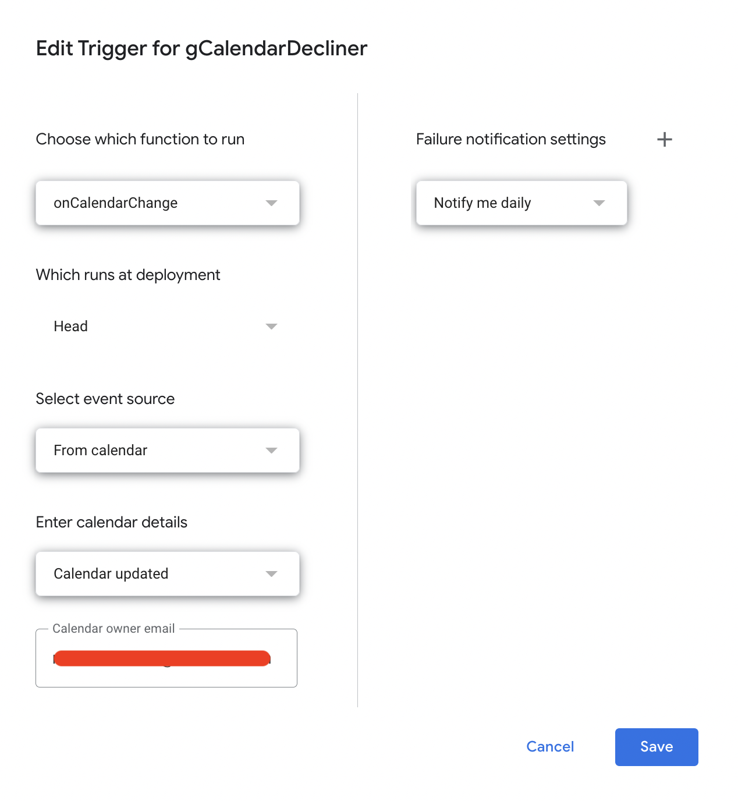

# gCalendarDecliner

## Introduzione

Questo script è stato creato con lo scopo di istruire i propri colleghi alla consultazione delle disponibilità del calendario prima di lanciare un invito ad un qualsiasi evento.

Lo script contiene all'interno la lista dei domini per i quali gli è concesso di intervenire rifiutando immediamente l'invito e inviando una email di notifica al creatore dell'evento e a te.

## Requisiti minimi

I requisiti necessari sono:

- un minimo di dimestichezza con l'informatica e la grande abilita di modificare, in modo guidato, un piccolo pezzettino di software;
- una casella di posta e un calendario su google
- l'accesso a google app scripts (https://script.google.com/home/start)

## Istruzioni

### Preparazione del progetto

- Entrare su google app script https://script.google.com/home/start
- Creare un nuovo progetto e dargli nome "gCalendarDecliner". All'interno del progetto trovere un file con nome "Code.gs". Va svuotato del suo contenuto.
- Aprire e copia incollare (sovrascrivendo tutto il contenuto) sul file Code.gs il contenuto di Code.js presente in questo repository e salvare.
- Aggiungere un nuovo file con nome "email" e copia incollare il contenuto di email.js all'interno del nuovo file.
- Tramite il tasto + della sezione Services aggiungere il servizio Calendar al progetto

il tuo progetto dovrebbe assomigliare a questo:



### Impostazioni

Modificare le seguenti variabili all'interno del file Code.gs con i valori desiderati:

```
MY_CALENDAR_ID = 'marco.sanson@develon.com';
MY_EMAIL = 'marco.sanson@develon.com';
ACTIVE_DOMAINS = [ 'develon.com', 'develondigital.com', 'pharmaround.it', 'hbenchmark.com', 'apps.develon.com', 'dticketing.com' ];
DAYS_TO_LOOK_AHEAD = 30;
```

MY_CALENDAR_ID: Contiene l'id del tuo calendario. Lo trovi nelle impostazioni del calendario sotto la voce "Calendar Id"

MY_EMAIL: Contiene il tuo indirizzo email a cui riceverai delle notifiche. Molto spesso coincide con il calendar id

ACTIVE_DOMAINS: Contiene la lista dei domini per cui lo script può rifiutare e inviare email

DAYS_TO_LOOK_AHEAD: Quanti giorni in avanti vuoi che lo script guardi ogni volta che viene lanciato;

### Trigger

Devi assicurarti l'opzione "Enable Chrome V8 runtime" nella sezione impostazioni del tuo progetto google app scripts sia disabilitata!

Vai nella sezione Trigger del tuo progetto e crea un trigger con le seguenti impostazioni:




## AVANZATE

Cambia tutto ciò che vuoi e puoi :)